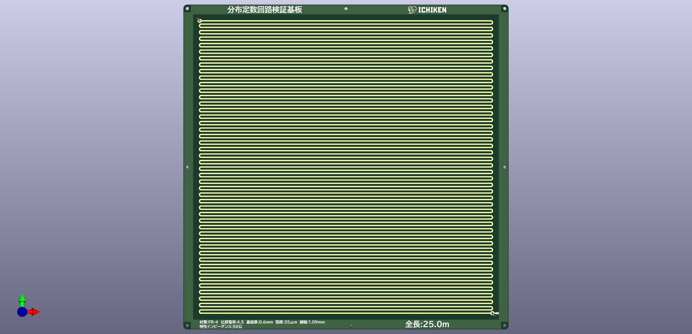

# 分布定数回路検証基板
## 概要
電圧の伝播や、パルス波形の反射を観察するために作成した基板です。  
銅箔厚さ35μm、基板厚さ0.6mm、材質FR4の誘電率4.5、配線幅1.09mmの基板で、特性インピーダンスが50Ωになるように設計しました。  
回路終端にあるジャンパを開放するか短絡させるかによって反射波が変化する様子を観察することができます。  
また、ジャンパに50Ω抵抗(100Ωの2並列)をはんだ付けすることによって、インピーダンス整合を取ることができます。
  
線同士の間隔が2mmで全長25mの基板と、間隔6.6mmで全長10.2mの2種類があります。  
特性インピーダンスの計算には以下サイトを使用しました。  
[Microstrip Impedance Calculator](https://www.allaboutcircuits.com/tools/microstrip-impedance-calculator/)

## 動画はこちら

